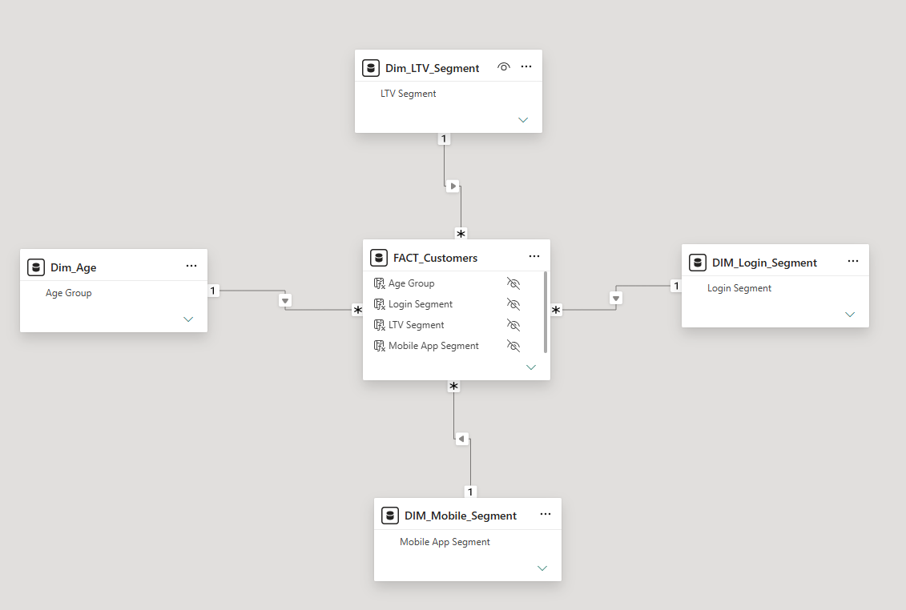
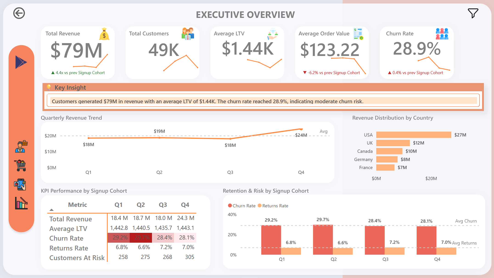
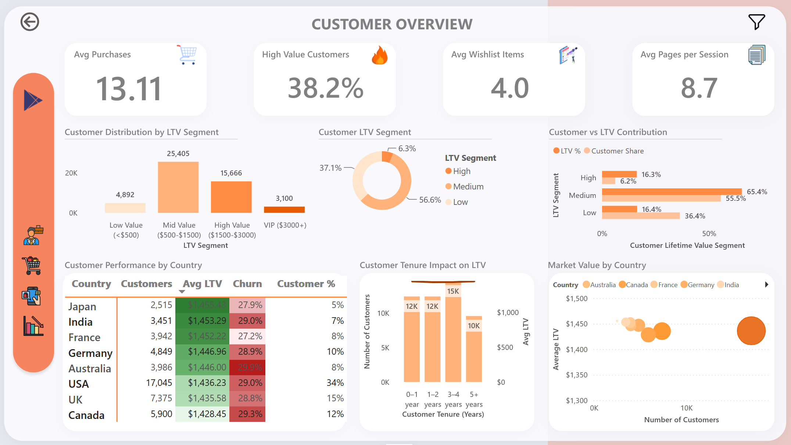
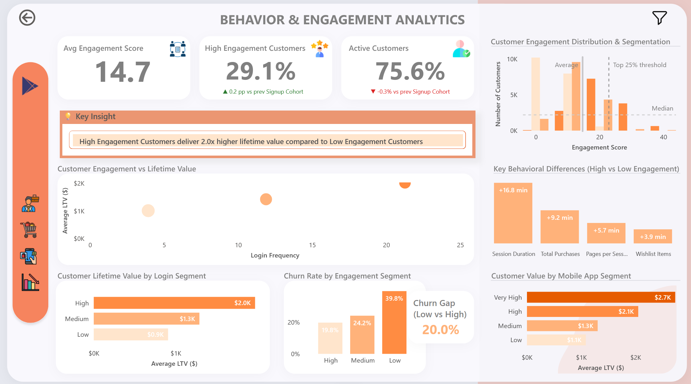
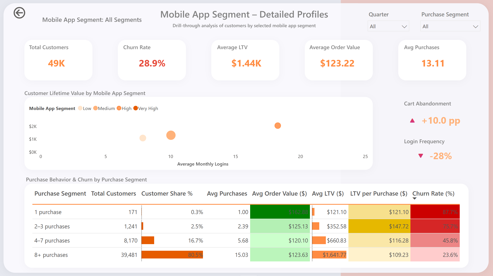
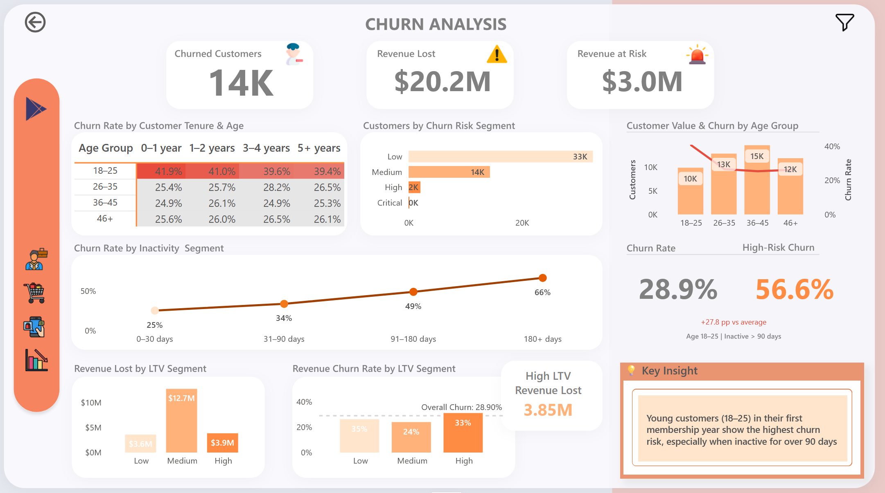
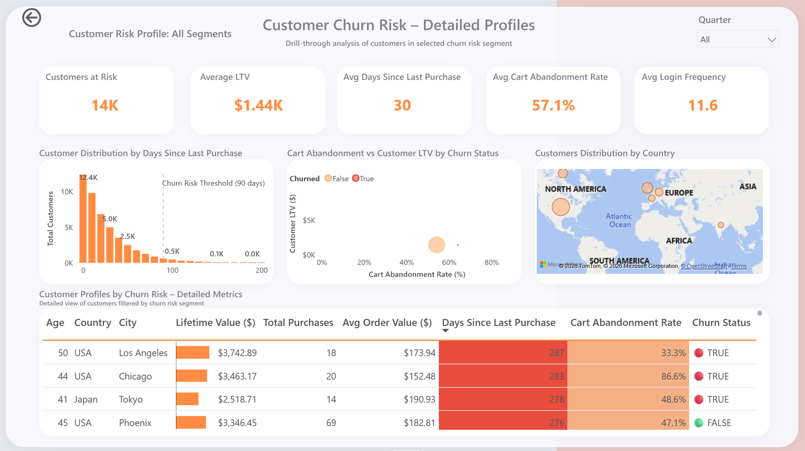
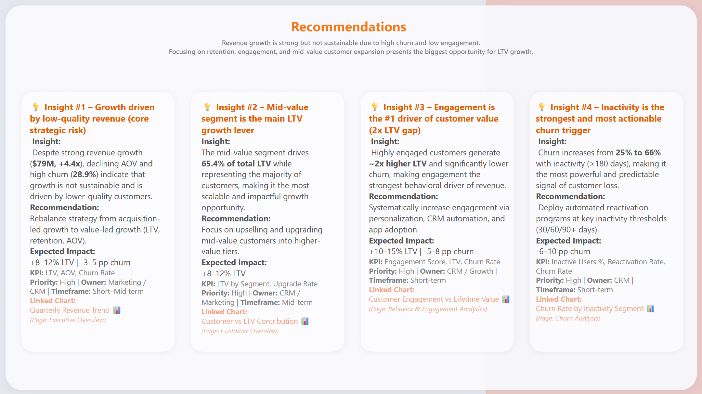

# 🛒 E-commerce Customer Analytics Dashboard | Power BI 

## 📌 Project Overview

The E-commerce Customer Analytics Dashboard is an end-to-end Business Intelligence solution developed in Power BI to analyze customer value, purchasing behavior, engagement, retention, and churn risk.

The project transforms raw customer and transactional data into actionable business insights, enabling stakeholders to identify high-value customer segments, understand revenue drivers, detect churn risks, and make data-driven decisions to improve customer lifetime value and business growth.

---

## 🎯 Business Objective

The primary goal of this project was to answer critical business questions:

* Which customer segments generate the highest revenue and lifetime value?
* What behavioral factors influence customer retention and churn?
* How does customer engagement impact business performance?
* Which customers are at risk of churning?
* What revenue is currently at risk?
* Which actions can improve customer retention and long-term profitability?

---

## 📊 Dataset

The analysis is based on customer and transactional e-commerce data covering approximately **50,000 customers**.

The dataset includes:

* Customer transactions
* Purchase history
* Revenue and spending behavior
* Customer Lifetime Value (LTV)
* Customer tenure
* Customer engagement metrics
* Login activity
* Cart abandonment behavior
* Geographic information
* Churn and retention indicators

---

## 🛠️ Tools & Technologies

* Power BI
* Power Query
* DAX
* Data Modeling
* Excel
* Business Intelligence
* Data Visualization

---

# 🏗️ Data Model

## 📐 Data Model Structure
The project utilizes a highly optimized **Star Schema** architecture designed to minimize analytical complexity, guarantee performance, and enforce clean data context propagation across all metrics.

The structure isolates transactional and behavioral attributes into a single central fact table, surrounded by dedicated dimensional boundaries.

### Data Model Schema Diagram

*   **Central Fact Table:**
    *   `FACT_Customers` – Holds primary customer transactional details, metrics, and foreign keys. Columns used for data relationships have been hidden from the report view to streamline usability and enforce model security.
*   **Dimension Tables:**
    *   `Dim_Age` – Groups customer demographics based on specific age brackets for targeted marketing.
    *   `Dim_LTV_Segment` – Defines structural tiers for Low, Mid, and High customer value.
    *   `DIM_Login_Segment` – Captures engagement groups built upon historical customer log-in frequencies.
    *   `DIM_Mobile_Segment` – Evaluates specific behaviors driven by mobile application interaction.

---

# 🧠 Key DAX Measures

The analytical power of this dashboard relies on core DAX measures that dynamically evaluate customer behavior, financial metrics, and retention risks across varying report filters:

### 📈 Average Customer Lifetime Value (LTV)
Measures the total revenue generated per customer over their lifetime, serving as the foundation for value-based segmentation.

### 📉 Churn Rate
The percentage of customers who have stopped engaging or purchasing within a defined period, used to track loyalty and retention health.

### ⚠️ Revenue at Risk
Estimates the potential future revenue loss by isolating active customers who exhibit high-risk churn indicators.

### 🕹️ Engagement Score
A composite metric calculated based on login frequency, site activity, and purchase behavior to quantify overall customer interaction.

### 🛒 Average Order Value (AOV)
Measures the average revenue generated per transaction, tracking buying patterns and checkout quality.

---

# 📈 Dashboard Structure

## 1️⃣ Executive Overview

Provides a high-level summary of business performance and customer health.

### Key KPIs

* Total Revenue ($79M)
* Total Customers (49K)
* Average Customer Lifetime Value ($1.44K)
* Average Order Value ($123.22)
* Churn Rate (28.9%)

### Analysis Included

* Quarterly Revenue Trend
* Revenue Distribution by Country
* Cohort Performance Analysis
* Customer Retention Overview
* Churn Risk Indicators

### Key Insight

Despite strong revenue growth, declining average order value and elevated churn indicate that growth quality may be deteriorating.

---

## 2️⃣ Customer Overview

Analyzes customer value distribution and segment contribution to revenue.

### Key KPIs

* Average Purchases (13.11)
* High-Value Customer Share (38.2%)
* Average Wishlist Items (4.0)
* Average Pages per Session (8.7)

### Analysis Included

* Customer Distribution by LTV Segment
* Customer vs LTV Contribution
* Country-Level Customer Value Analysis
* Customer Tenure Impact on LTV
* Market Value by Country

### Key Insight

The Mid-Value customer segment generates 65.4% of total LTV, representing the largest opportunity for scalable growth.

---

## 3️⃣ Behavior & Engagement Analytics

Explores customer engagement patterns and their impact on business outcomes.

### Key KPIs

* Average Engagement Score (14.7)
* High Engagement Customer Share (29.1%)
* Active Customers (75.6%)
* Engagement Distribution

### Analysis Included

* Customer Engagement vs Lifetime Value
* Customer Lifetime Value by Login Segment
* Churn Rate by Engagement Segment
* Mobile App Engagement Analysis
* Behavioral Differences Between High and Low Engagement Customers

### Key Insight

Highly engaged customers generate approximately 2x higher lifetime value than low-engagement customers.

---

## 4️⃣ Mobile App Segment Drill-Down

Provides detailed profiling of customers based on mobile app activity and purchase behavior.

### Key KPIs

* Total Customers (49K)
* Churn Rate (28.9%)
* Average LTV ($1.44K)
* Average Order Value ($123.22)
* Average Purchases (13.11)

### Analysis Included

* Customer Lifetime Value by Mobile App Segment
* Login Activity Analysis
* Cart Abandonment Trends (+10.0 pp)
* Purchase Behavior by Segment
* Revenue and Churn by Purchase Frequency

### Key Insight

Customers with higher mobile engagement demonstrate significantly higher lifetime value and lower churn rates.

---

## 5️⃣ Churn Analysis

Identifies key drivers of customer churn and quantifies revenue impact.

### Key KPIs

* Churned Customers (14K)
* Revenue Lost ($20.2M)
* Revenue at Risk ($3.0M)
* Overall Churn Rate (28.9%)
* High-Risk Churn Segment (56.6%)

### Analysis Included

* Churn Rate by Age Group
* Churn Rate by Customer Tenure
* Churn Rate by Inactivity Segment
* Revenue Loss by LTV Segment
* Revenue at Risk Analysis
* High-Value Customer Churn Impact

### Key Insight

Customers aged 18–25 in their first year of membership exhibit the highest churn risk, particularly when inactive for extended periods.

---

## 6️⃣ Customer Churn Risk Drill-Down

Provides a detailed investigation of customers identified as high churn risk.

### Key KPIs

* Customers at Risk (14K)
* Average LTV ($1.44K)
* Average Days Since Last Purchase (30)
* Average Cart Abandonment Rate (57.1%)
* Average Login Frequency (11.6)

### Analysis Included

* Customer Distribution by Days Since Last Purchase
* Cart Abandonment vs Customer LTV by Churn Status
* Customer Distribution by Country
* Customer Risk Profiling Table with Detailed Metrics

### Key Insight

Customers with prolonged inactivity, low login frequency, and high cart abandonment rates exhibit significantly higher churn probability and represent the largest source of future revenue risk.

---

## 7️⃣ Strategic Recommendations

Converts analytical findings into business actions and prioritizes initiatives based on expected impact.

Each recommendation includes:

* Business Insight
* Strategic Recommendation
* Expected Business Impact
* KPI Ownership
* Priority Level
* Responsible Team
* Timeframe
* Supporting Visualization

---

# 📊 Key Business Insights

### 💡 Insight #1 – Growth Is Driven by Low-Quality Revenue

**Finding**

Despite strong revenue growth ($79M, +4.4x), declining AOV and high churn indicate that growth may not be sustainable.

**Recommendation**

Shift focus from acquisition-led growth to value-led growth centered on retention, LTV, and customer quality.

**Expected Impact**

* +8–12% LTV
* -3–5 pp Churn

**KPIs**

* LTV
* AOV
* Churn Rate

---

### 💡 Insight #2 – Mid-Value Customers Are the Main Growth Lever

**Finding**

The Mid-Value segment contributes 65.4% of total LTV and represents the largest customer group.

**Recommendation**

Implement targeted upselling and cross-selling initiatives to move customers into higher-value tiers.

**Expected Impact**

* +8–12% LTV

**KPIs**

* LTV by Segment
* Upgrade Rate

---

### 💡 Insight #3 – Engagement Is the Strongest Driver of Customer Value

**Finding**

Highly engaged customers generate approximately twice the lifetime value of low-engagement customers.

**Recommendation**

Increase engagement through personalization, CRM automation, and mobile app adoption strategies.

**Expected Impact**

* +10–15% LTV
* -5–8 pp Churn

**KPIs**

* Engagement Score
* LTV
* Churn Rate

---

### 💡 Insight #4 – Inactivity Is the Strongest Churn Trigger

**Finding**

Churn increases rapidly among customers inactive for more than 90 days, peaking within the high-risk segments.

**Recommendation**

Deploy automated reactivation programs at critical inactivity thresholds (30, 60, and 90+ days).

**Expected Impact**

* -6–10 pp Churn

**KPIs**

* Inactive Users %
* Reactivation Rate
* Churn Rate

---

# 🧠 Skills Demonstrated

## Data Preparation

* Data cleaning and transformation
* Power Query ETL processes
* Data quality validation

## Data Modeling

* Star Schema Design
* Fact & Dimension Modeling
* Relationship Management

## DAX & Analytics

* Customer Lifetime Value (LTV)
* Churn Rate Calculations
* Revenue at Risk Metrics
* Customer Segmentation
* Cohort Analysis
* KPI Development

## Data Visualization

* Interactive Dashboard Design
* Executive Reporting
* Customer Segmentation Visualizations
* Churn Analytics Dashboards
* Business Storytelling

## Business Analysis

* Customer Analytics
* Retention Analysis
* Churn Prediction Support
* Revenue Optimization
* Strategic Recommendation Development

---

# 📷 Dashboard Preview

### Executive Overview

### Customer Overview

### Behavior & Engagement Analytics

### Mobile App Segment Drill-Down

### Churn Analysis

### Customer Churn Risk Drill-Down

### Recommendations

---

# 🔗 Project Links

**Power BI Dashboard:** [https://app.powerbi.com/view?r=eyJrIjoiYTY0MmQ3MjctNjhiYS00NTg1LWI0ZGUtZDA5NjBmMWI4NmRmIiwidCI6IjNkZmU5YWI2LTgxYmYtNDkxYy1iNjcwLTAxYzgyNGEwOWUxOSJ9]

**GitHub Repository:** [https://github.com/katarzyna-miechowska-bi/ecommerce-customer-analytics-dashboard]

---

# 📬 Contact

Feel free to connect with me on LinkedIn to discuss this project, Power BI development, Business Intelligence, or Data Analytics opportunities.

---

# ⭐ Portfolio Project

This project demonstrates a complete Business Intelligence workflow—from data preparation and modeling to advanced customer analytics, churn analysis, KPI development, and strategic business recommendations. The dashboard showcases how customer data can be transformed into actionable insights that support revenue growth, customer retention, and long-term business performance. 

